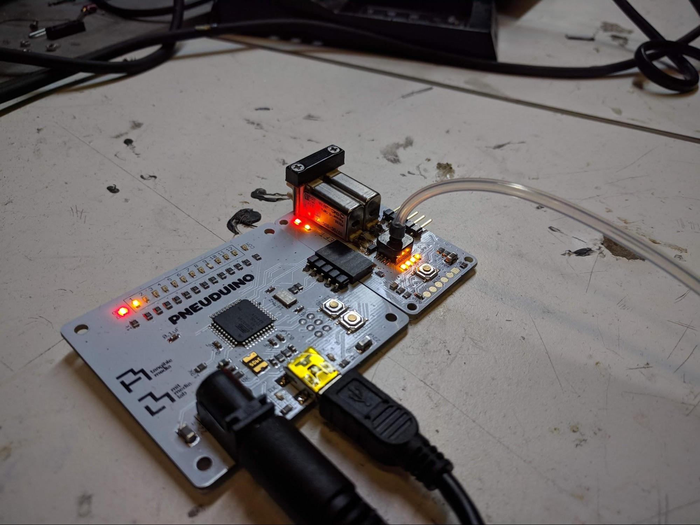

## Read Pressure
**Boards:** Master and one valve board 
**Tube connections:** Connect the pressure sensor to the compressed air supply as shown

 

Each Pneuduino valve board has a pressure sensor, located behind the valves. Below the pressure sensor, a set of LEDs displays the relative magnitude of the current pressure. This example shows the code necessary to read the sensor. Connect a tube to the pressure sensor as shown, and connect the compressed air supply to the tube. Run the program, and the pressure of the compressed air will be printed to the serial console. Disconnect the pressure sensor, and the pressure should drop.

The pressure sensor outputs an integer from 0 to 255. Atmospheric pressure is typically around 60, and the maximum safe pressure for inflatables is roughly 90. This range is also used as the lower and upper pressure bounds for the indicator LEDs below the pressure sensor.

